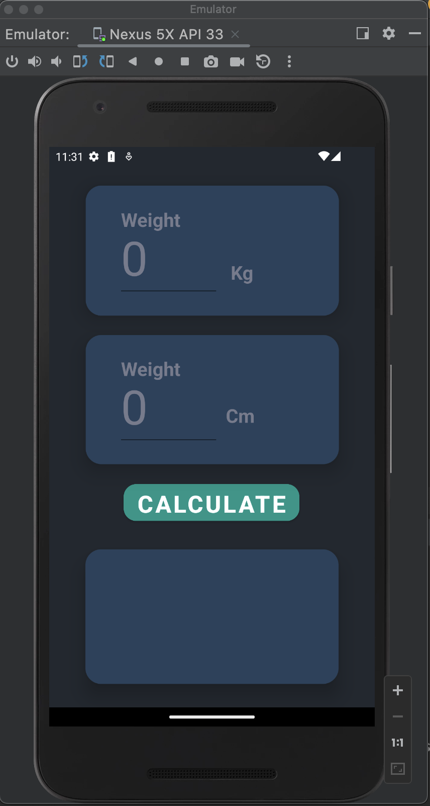
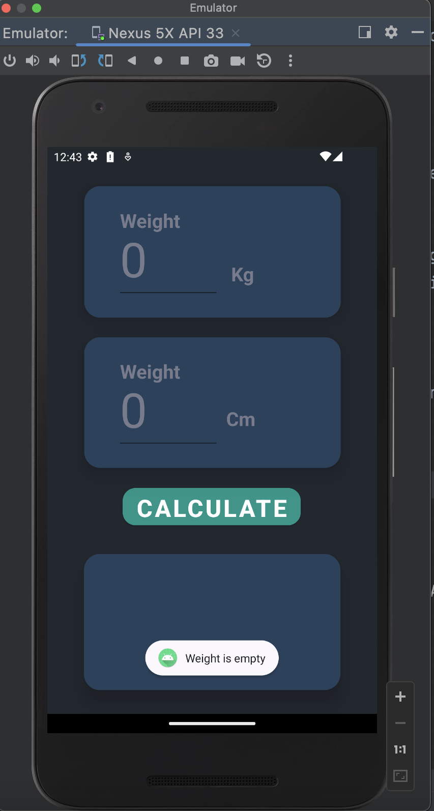
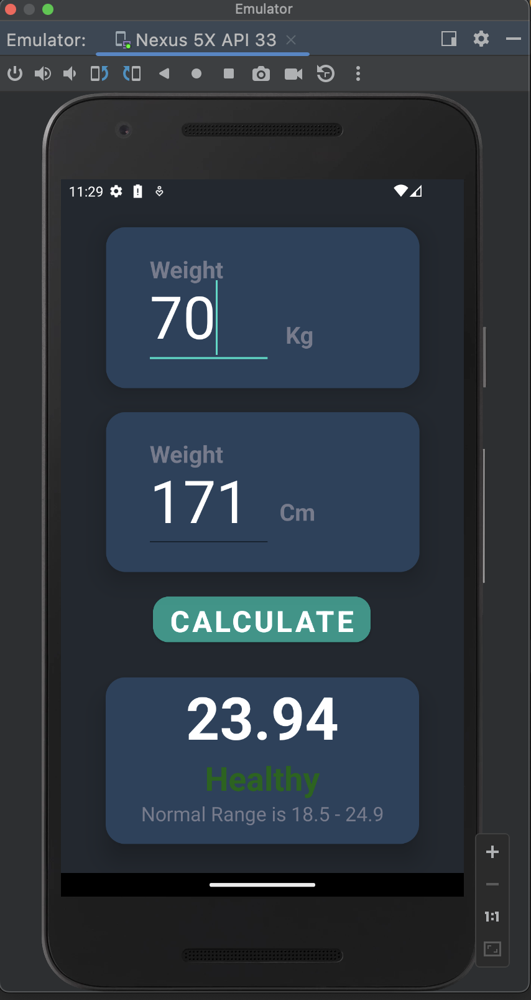
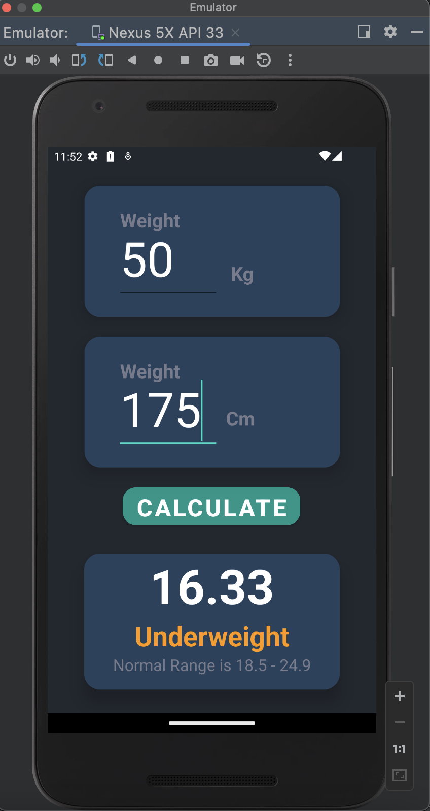
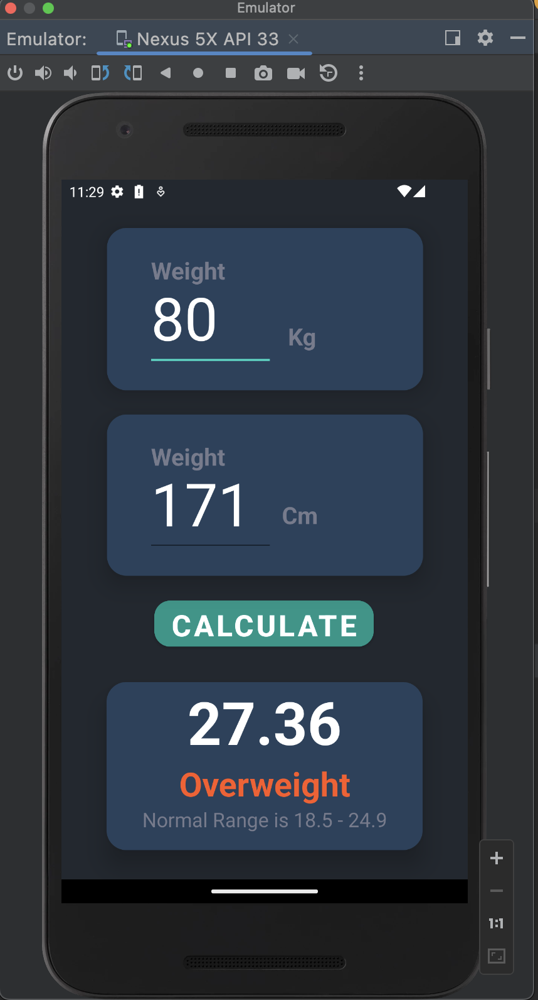
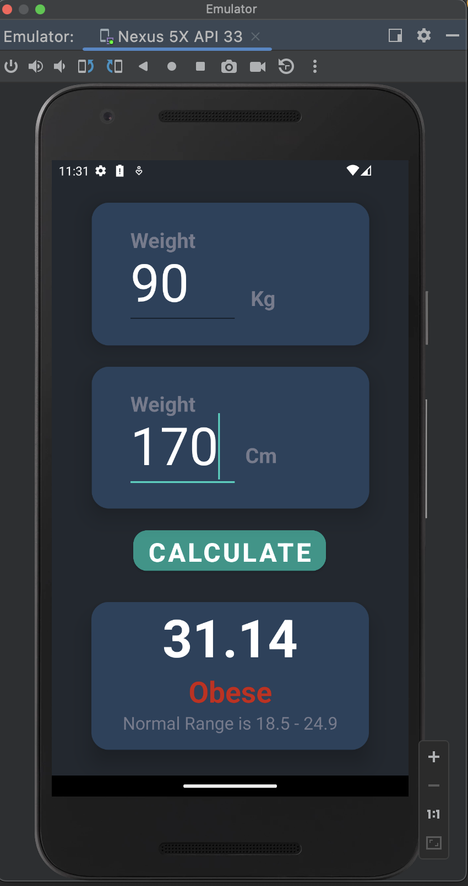

# 01_Android-Kotlin-BMI-Calculator
Learning android using the kotlin programming language. Here is a simple BMI calculator

  <table>
    <tr>
      <td></td>
      <td></td>
      <td></td>
    </tr>
    <tr>
      <td></td>
      <td></td>
      <td></td>
    </tr>
  </table>

## Technical Skills used in this small project:
<ol>
  <li>Kotlin: Applied basics of Kotlin for Android app development.</li>
  <li>Android Activity Lifecycle: Demonstrated understanding of activity creation with onCreate().</li>
  <li>Android UI Components: Used EditText, Button, and TextView components for UI.</li>
  <li>Event Handling: Handled button click events using setOnClickListener.</li>
  <li>Input Validation: Implemented basic error checking and user feedback with Toast messages.</li>
  <li>UI Manipulation at Runtime: Updated TextViews dynamically based on input and calculations.</li>
  <li>Android Resources: Leveraged resource IDs to access and use Android resources.</li>
  <li>Mathematical Computation: Applied basic mathematical operations to calculate BMI.</li>
  <li>Kotlin Control Flow: Utilized conditional expressions (if and when) for flow control.</li>
  <li>Problem Solving & Project Management: Employed essential problem-solving skills and project management techniques throughout the project.</li>
</ol>

